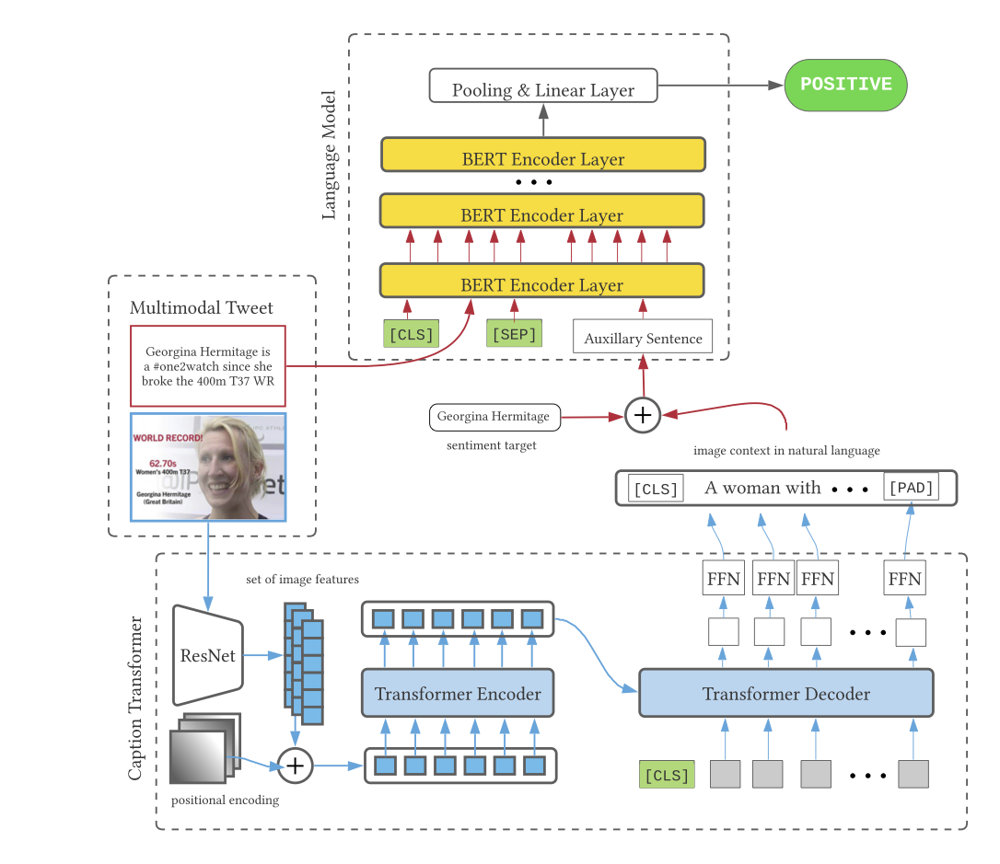

[](https://www.nature.com/articles/nature14539)
[](https://papers.nips.cc/book/advances-in-neural-information-processing-systems-31-2018)
# Exploiting BERT for Multimodal Target Sentiment Classification Through Input Space Translation 

# Running The Code
## Data 
Download the Twitter-17 dataset [here](https://github.com/jefferyYu/TomBERT/tree/master/absa_data/twitter), and the Twitter-15 dataset [here](https://github.com/jefferyYu/TomBERT/tree/master/absa_data/twitter2015).
You don't need the images to run the code in the repo, but if you want to download them, there are instructions in the TomBERT repo [here](https://github.com/jefferyYu/TomBERT#download-tweet-images-and-set-up-image-path).

## Generating Captions
The captions used in the paper are provided in the files `twitter2015_images.json` and `twitter2017_images.json`. 
If you want to generate your own captions

## Training \& Evaluation
The training/eval scripts are very straightforward, and follow the same structure.
Looking at `EF_CapBERT_Tw15.py` as a concrete example, all you need to do is edit the following lines:
```python
train_tsv = "/path/to/the/file"
dev_tsv = "/path/to/the/file" 
test_tsv = "/path/to/the/file" 
captions_json = "/path/to/the/file"
```
to match where you've placed the files.

